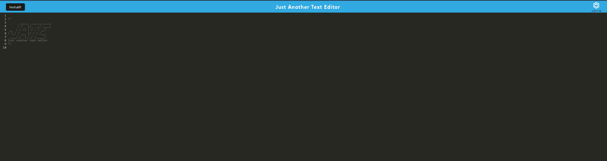
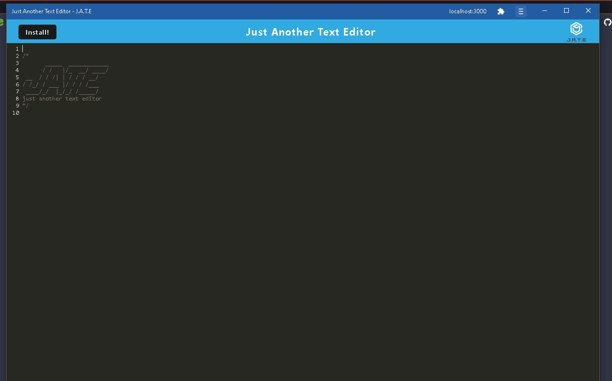

# operation-manifestation
A simple PWA text editor 

## Table of Contents
- [Description](#description)
- [Technologies](#technologies)
- [Installation](#installation)
- [Usage](#usage)
- [Deployed-application](#deployed-application)
- [Preview](#preview)
- [Contributing](#contributing)
- [Author](#author)

## Description
This application allows a user to write notes and code using a local database which enables it to be used offline and make changes to documents. The text editor runs on a browser which the application can then be installed locally on a computer to create notes. 

## Technologies
* JavaScript
* Node.js
* Express.js
* Webpack
* Babel
* IndexedDB

## Installation 
`npm i`
`npm start`

## Usage 
Open the app in the browser after doing the installation steps. Write whatever you want on the browser version. Then you can hit the install button and it will download an offline version where you can add whatever you want offline. 

## Deployed Application 
Link to deployed application on Heroku: https://jate-manifestation.herokuapp.com/

## Preview 
Web version:

Installed Version:

## Contributing
There was already some starter code provided for this project here: https://github.com/coding-boot-camp/cautious-meme
In the contributors location on github you will see this on the profile.

## Author 
Eduardo Figueroa

[Github Profile](https://github.com/eddiefigueroa18)
